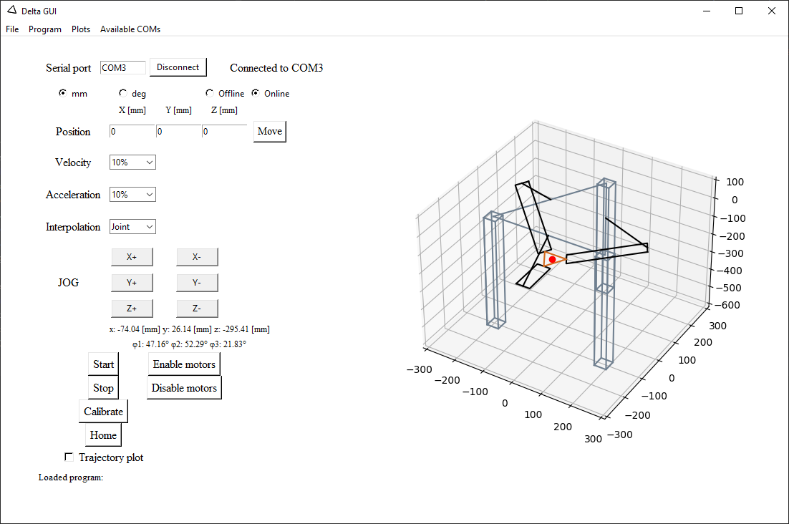
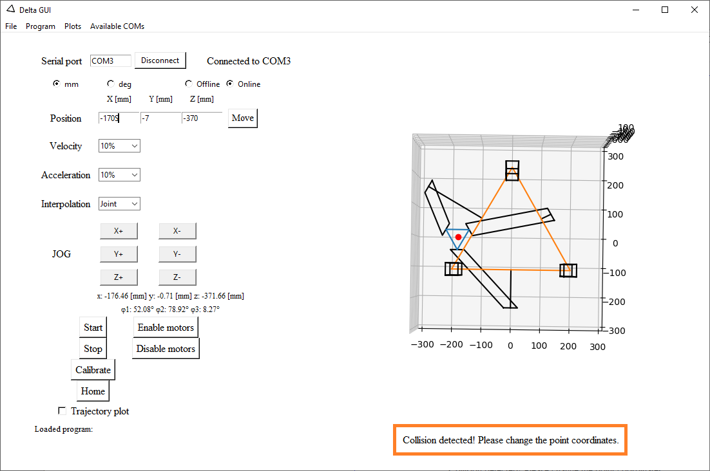
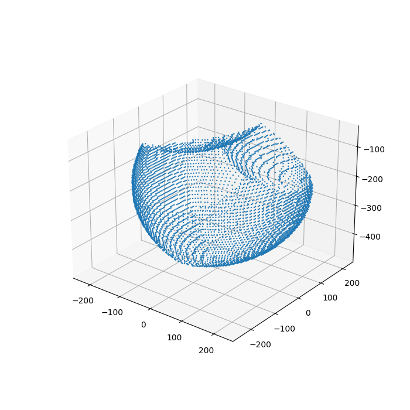
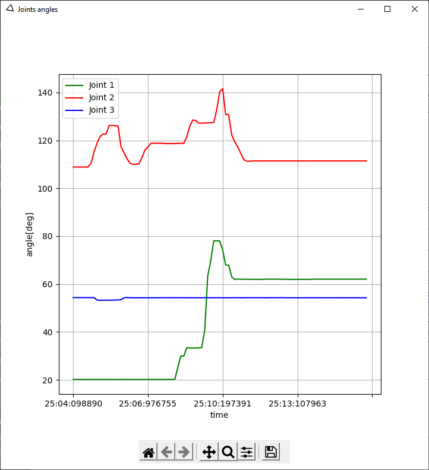
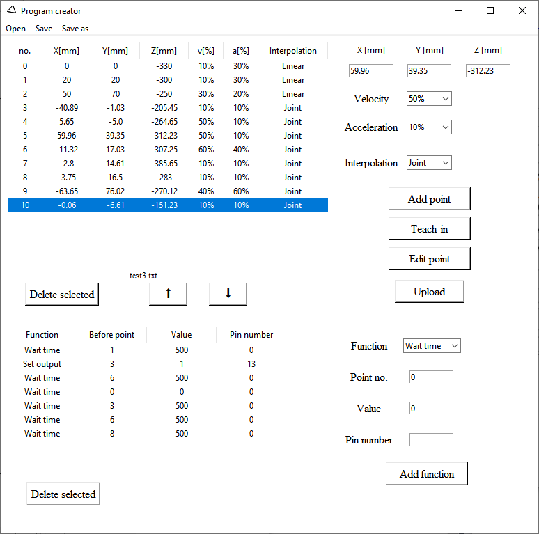
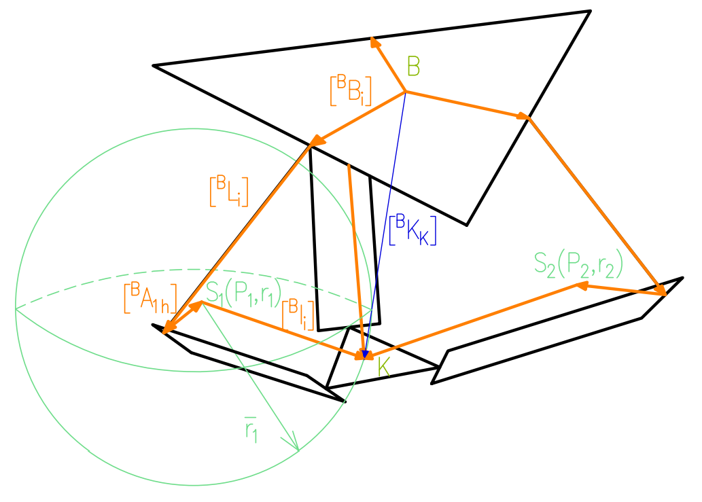

# DIY Delta robot

## For your daily needs

**This repo gives a brief (for now) explanation about designing, modeling, building, wiring and programming delta type robot.**

### What does this repository include?
- Application controlling the robot with **live visualization** of the kinematics written in Python
- 3D model of the whole robot, as well as 3D models of all the parts that need to be printed
- BOM
- Build instructions
- Inverse and Forward Kinematics equations with derivation

### Features
- Both online and offline working mode - in offline you can simulate the robot's configuration in different positions
- Bluetooth connection
- Basic manual control by providing x,y,z coordiantes or  
- Basic relative position control in Jog mode
- Enabling/disabling motors
- Starting/stoping the program
- Encoders calibration
- Homing
- Changing TCP offset and Jog step
- Changing Z axis limit
- Live robot kinematics visualization
- Live TCP displacement plot in x,y,z coordinates
- Live joints displacement plot in angular coordinates
- Creating and manipulating robot programs, saving, opening and editing. Points can be set either by manually typing in the coordinates or by a teach-in method, in which you hold the robot in a certain position and take it's current configuration as a point's coordiante

### Pictures and screenshots presenting the robot and application
Main screen             |  Collision detection
:-------------------------:|:-------------------------:
  |  
Work envelope             |  Real robot
  |  
Joints plot             |  Program creator
  |  
Kinematics drawing
 | 
